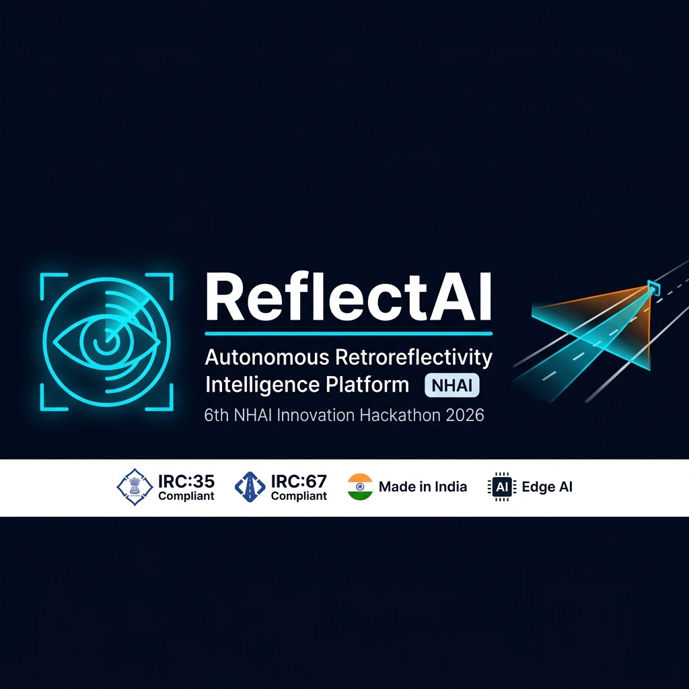

<div align="center">
  
  <br><br>

  
  
  
  
</div>

---

## The Problem

NHAI manages over **50,000 km** of national highways. Retroreflectivity compliance for road signs, pavement markings, and road studs is mandated under **IRC:35** and **IRC:67** — but today, it is measured entirely using handheld devices operated by workers standing on live, high-speed expressways.

This is slow (2–3 km/h), dangerous, expensive (requires lane closures), and reactive. There is no predictive capability and no network-wide visibility.

---

## The Solution

**ReflectAI** is a vehicle-mounted, AI-powered retroreflectivity measurement platform. By retrofitting existing NHAI highway patrol vehicles with an affordable multi-modal sensor pod, it continuously captures highway data at **80+ km/h** — with zero traffic disruption.

Our edge AI model, **ReflectNet**, uses physics-informed deep learning and polarimetric imaging to estimate the Coefficient of Retroreflection (R_L) across all asset types simultaneously: signs, pavement markings, road studs, and delineators.

---

## Features

| Feature | Detail |
|---|---|
| **High-Speed Survey** | Operates at 80–100 km/h; 100% continuous coverage |
| **Multi-Asset Detection** | Signs, markings, studs, delineators — all in one pass |
| **Physics-Informed AI** | YOLOv8 segmentation + EfficientNet-B4 RL regression (±12% accuracy) |
| **All-Weather Operation** | Day, Night, Wet, Foggy via WeatherNet domain adaptation |
| **Predictive Maintenance** | LSTM model forecasts asset failure up to 90 days in advance |
| **Drone Integration** | Gantry sign inspection via UAV without lane closures |
| **SaaS Command Center** | GIS heatmap, real-time alerts, automated IRC compliance reports |

---

## System Architecture

```
┌──────────────────────────────────────────────────────────────┐
│  SENSING LAYER          AI LAYER              MANAGEMENT     │
│  (Vehicle / Drone)      (Edge + Cloud)        (SaaS)         │
│                                                              │
│  Stereo RGB Cameras ──► ReflectNet CNN ──► GIS Dashboard     │
│  NIR Camera         ──► YOLOv8 Detect  ──► Mobile App        │
│  Polarimetric Array ──► WeatherNet     ──► Alert System      │
│  GPS/IMU + OBD-II   ──► DegradeLSTM   ──► Maintenance Sched │
│  UAV Pod (Drone)    ──► Edge Inference ──► IRC PDF Reports   │
└──────────────────────────────────────────────────────────────┘
```

---

## Dashboard Modules

1. **Live Scan** — Real-time dual-feed (RGB + Depth) with AI bounding boxes and live telemetry.
2. **Network Map** — GIS heatmap showing compliance status across all NHAI corridors.
3. **Predictive Analytics** — LSTM degradation forecasting with maintenance priority queue.
4. **Drone Ops** — Gimbal camera feed management for overhead gantry inspection.
5. **IRC Reports** — One-click automated compliance report generation.

---

## Tech Stack

**Frontend:** HTML5, CSS3 (Glassmorphism), Vanilla JS, Chart.js, Lucide Icons  
**AI/ML (Concept):** Python, PyTorch — YOLOv8 + EfficientNet-B4 + LSTM on NVIDIA Jetson Orin  
**Sensing (Hardware):** Stereo RGB, NIR, Polarimetric Camera, RTK GPS/IMU, OBD-II

---

## Running Locally

No build tools or package managers needed.

```bash
git clone https://github.com/CodyRohith7/Reflect_AI.git
cd Reflect_AI
# Open demo/index.html in Chrome/Edge/Firefox
```

Click **Start Scan** on the dashboard to launch the simulated highway AI detection feed.

---

## Evaluation Alignment (NHAI Hackathon)

| Criterion | Approach |
|---|---|
| **Innovation (30%)** | First system using polarimetric imaging + AI for non-contact, multi-asset RL estimation |
| **Feasibility (30%)** | COTS hardware kit (~₹2–3L), retrofits onto existing patrol vehicles in 2 hours |
| **Scalability (20%)** | Cloud-native SaaS; deployable across 50,000+ km network with no hardware changes |
| **Presentation (20%)** | Fully functional interactive prototype with live simulation |

---

## Author

**Rohith** — Solo Submission  
6th NHAI Innovation Hackathon, April 2026  
Problem Statement: High-quality retro-reflectivity measurement solutions for road markings and signboards
